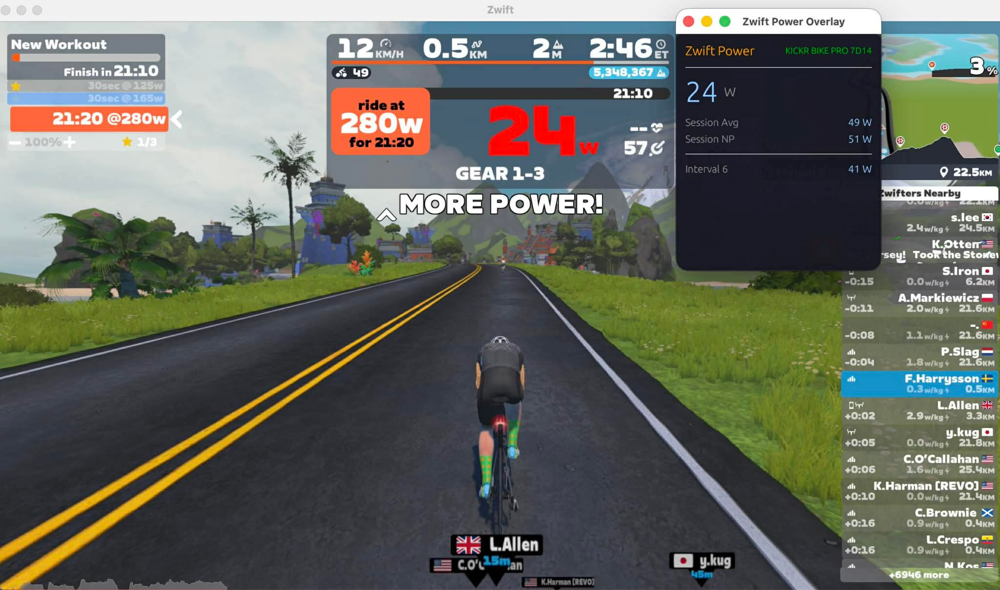

# Zwift Power Overlay

> **Built entirely by [Claude Code](https://claude.ai/claude-code)** — from architecture decisions and BLE protocol research to every line of Rust.

A lightweight, always-on-top power overlay for [Zwift](https://www.zwift.com) that connects directly to your power meter via Bluetooth and automatically tracks structured workout intervals.



## Why This Exists

Zwift's built-in HUD doesn't show average power. Third-party overlays like Sauce for Zwift, while very featureful, require running a second Zwift client with separate credentials and a subscription.

**Zwift Power Overlay takes a different approach.** It connects directly to your power meter over Bluetooth Low Energy and reads Zwift's log file to detect interval boundaries — no second account, no network sniffing, no dependencies on other software. Start Zwift, start the overlay, pick your power meter, and ride.

## What You Get

- **Session average power** across your entire ride
- **Session normalized power (NP)** — calculated from 30-second rolling averages
- **Automatic interval tracking** — detects when Zwift starts a new interval in your structured workout and shows interval average power in real time
- **One-click device switching** — tap the device name to reconnect to a different power meter mid-ride
- **Always on top** — sits over Zwift without stealing focus
- **Tiny footprint** — a single native binary, for **macOS** and **Windows**

## Quick Start

### From Build
Go to the [Releases page on Github](https://github.com/folsen/zwift-overlay/releases) to download a pre-built binary for macOS and Windows.

### From Source

```sh
# Clone and build
git clone https://github.com/folsen/zwift-overlay.git
cd zwift-overlay
cargo build --release

# Run
cargo run --release
```

### macOS .app Bundle

```sh
cargo install cargo-bundle
cargo bundle --release
open target/release/bundle/osx/Zwift\ Power\ Overlay.app
```

For signed and notarized distribution builds, see `build-macos.sh`.

### Usage

1. Start Zwift and begin (or load) a workout
2. Launch Zwift Power Overlay
3. Select your power meter from the device list
4. Ride — intervals are detected automatically from your structured workout

---

## How It Works

The overlay has three independent subsystems that communicate through channels:

### BLE Power Source (`data_source.rs`)

Connects to any Bluetooth Low Energy device that exposes the **Cycling Power Service (UUID 0x1818)** and subscribes to the **Cycling Power Measurement characteristic (0x2A63)**. The app continuously scans for exercise devices, filtering by both standard BLE fitness service UUIDs and known equipment brand names (Wahoo, Tacx, Stages, etc.) to handle devices that don't advertise standard services in their scan response.

The BLE layer runs on a Tokio async runtime, streaming power readings to the GUI over an `mpsc` channel. A separate command channel allows the GUI to trigger connect/disconnect operations.

### Interval Detection (`log_watcher.rs`)

Zwift writes structured workout events to its log file in real time:

```
[9:05:05] INFO LEVEL: [Splits] Cycling Split 1 started
```

A dedicated thread polls `~/Documents/Zwift/Logs/Log.txt` (macOS) or `%USERPROFILE%\Documents\Zwift\Logs\Log.txt` (Windows) once per second, parsing these lines to detect interval boundaries. This maps 1:1 with lap records in Zwift's exported FIT files — verified against actual ride data.

The watcher handles log rotation (new Zwift sessions truncate the file) and starts reading from the end of the file so only new events trigger interval changes.

### Metrics Engine (`metrics.rs`)

Tracks three metrics:

- **Session average**: running sum / sample count
- **Interval average**: reset on each `[Splits]` event, same calculation scoped to the current interval
- **Normalized power**: maintains a 30-second sliding window of timestamped samples. Once the window spans >= 29 seconds, the windowed average is raised to the 4th power and accumulated. NP = fourth root of the mean of these values.

### GUI (`overlay.rs`)

Built with [egui](https://github.com/emilk/egui) via eframe. Three screens:

1. **Device Picker** — shows discovered exercise devices with continuous background scanning
2. **Connecting** — spinner while BLE connection and service discovery complete
3. **Overlay** — live power display with session and interval metrics

Power values are color-coded by zone: grey (zero), blue (<100W), green (<200W), yellow (<300W), orange (<400W), red (400W+).

### Architecture

```
┌─────────────┐    mpsc     ┌──────────────┐
│  BLE Thread  │───────────>│              │
│ (data_source)│<───────────│   GUI Loop   │
│              │  cmd chan   │  (overlay)   │
└─────────────┘             │              │
                            │  ┌────────┐  │
┌─────────────┐    mpsc     │  │metrics │  │
│  Log Watcher │───────────>│  └────────┘  │
│(log_watcher) │            └──────────────┘
└─────────────┘
```

## License

[MIT](LICENSE)
